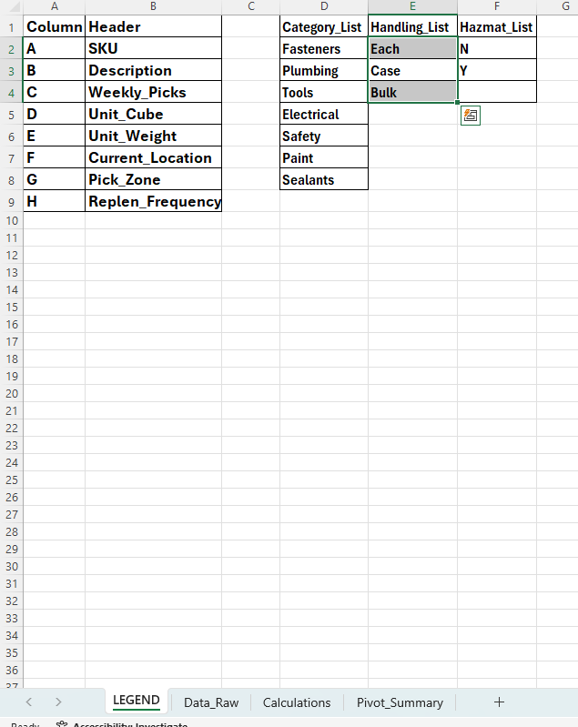
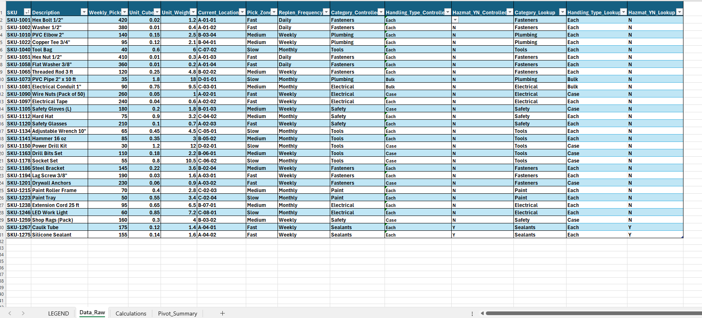
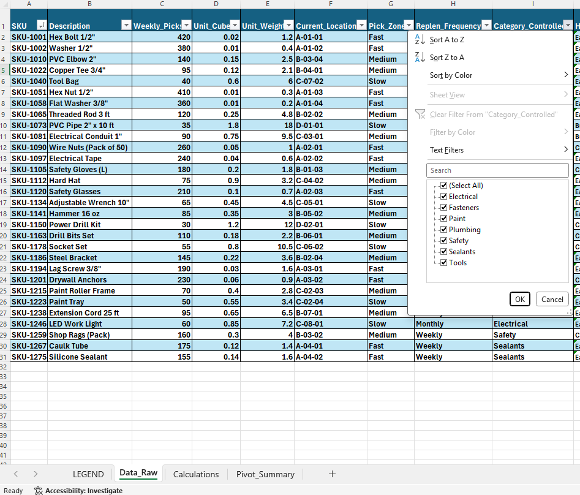
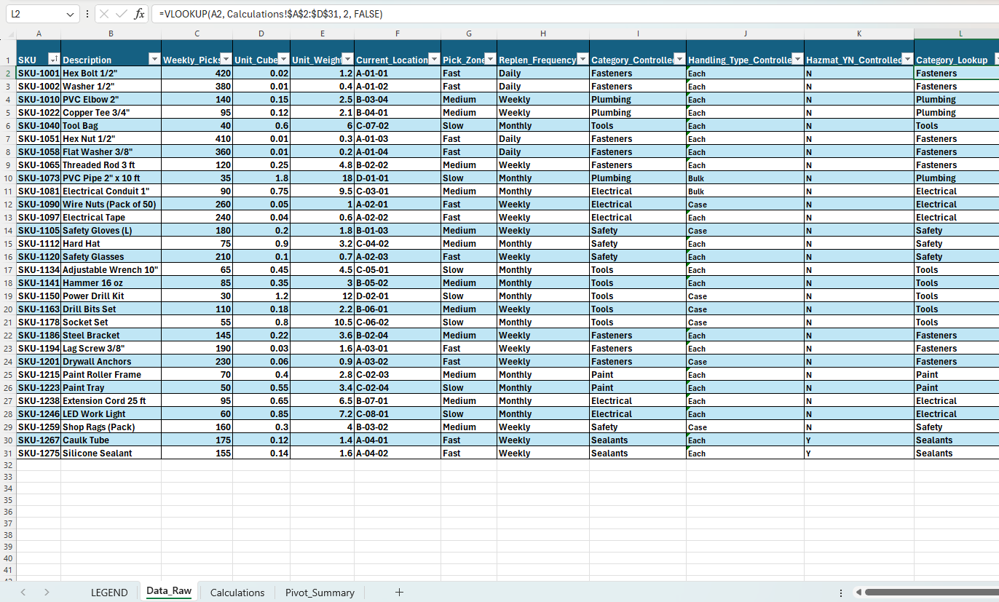
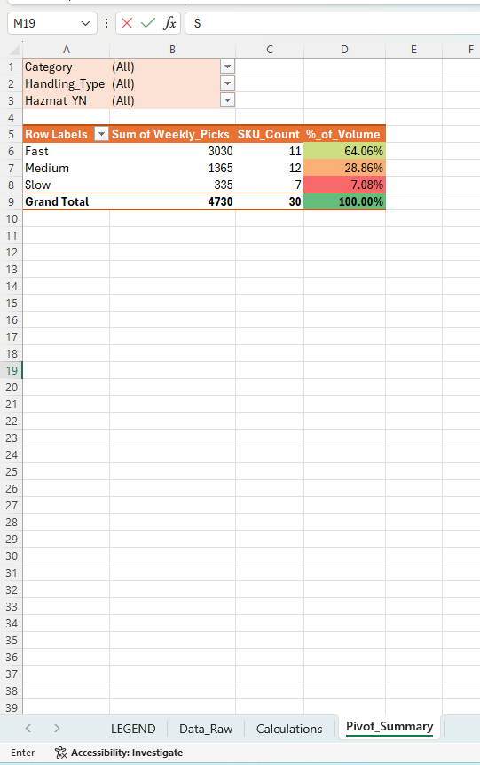

# DC Slotting & Space Management Portfolio

## Overview

This repository demonstrates my approach to distribution center slotting, space optimization, and inventory flow management from a manager-level operational perspective. The portfolio is designed to mirror real-world DC slotting and flow responsibilities, with a strong emphasis on Excel-driven decision support, KPI management, and WMS-aligned concepts.

All data used is mock or simulated and intended solely to demonstrate analytical methods, operational thinking, and leadership approach. No proprietary systems, layouts, or datasets are included.

---

## Purpose of This Portfolio

This portfolio was created to showcase how I would approach a **Manager, Distribution Center – Slotting & Space Management** role, including:

- SKU velocity analysis and ABC classification  
- Slotting optimization and flow improvement  
- Bin saturation and cube utilization management  
- Replenishment logic and pick-face design  
- Safety and ergonomic slotting principles  
- Seasonal and temporary inventory planning  
- KPI-driven operational reviews  
- Structured 30-60-90 day execution planning  

The focus is on practical execution, measurable impact, and cross-functional alignment with Operations, IT, Safety, and Inventory Planning teams.

---
## Execution Framework

- 📘 [30-60-90 Day Slotting & Space Management Execution Plan](docs/30-60-90-slotting-execution-plan.md)

## Tools & Skills Demonstrated

### Excel Proficiency

This portfolio intentionally emphasizes Excel as a decision-support tool, including:

- Pivot Tables (SKU velocity, ABC analysis, KPI summaries)  
- Formulas (cube utilization, bin saturation %, capacity thresholds)  
- Lookups (VLOOKUP / XLOOKUP for SKU and location attributes)  
- Filters to isolate high-impact SKUs  
- Conditional formatting for risk and congestion flagging  

### Operational & Systems Thinking

- Velocity-based slotting strategy  
- WMS-aligned concepts (locations, bins, pick faces, replenishment triggers)  
- Flow optimization and congestion reduction  
- Capacity planning for seasonal and peak demand  
- KPI definition and review cadence  

VLOOKUP Usage
SKU attributes are also populated using VLOOKUP with exact match against a master reference table to demonstrate traditional Excel lookup proficiency.

## Excel Slotting Model – Visual Walkthrough

### 1. Master Data & Controlled Lists

### 2. Raw SKU Data Structure

### 3. Data Validation Controls

### 4. VLOOKUP Master Data Mapping

### 5. Pick Zone Velocity Analysis

### 6. Interactive Filtering

### 7. % of Volume Visualization

### 8. ABC Classification & Velocity Analysis

### 9. Slotting & Hazmat Decision Logic

### 10. Pick-Face Utilization & Congestion Risk

### 11. Leadership Pivot Summary

---

## Disclaimer

All examples in this repository are fictional and for demonstration purposes only. They are not based on any specific company’s proprietary data, layouts, systems, or processes.

---

## Author

**Geoffrey Threats**  
MBA -ERP, MS - MIS, MS -Advanced Data Analytics
---
Distribution Center Operations | Slotting & Space Management | Analytics-Driven Leadership

